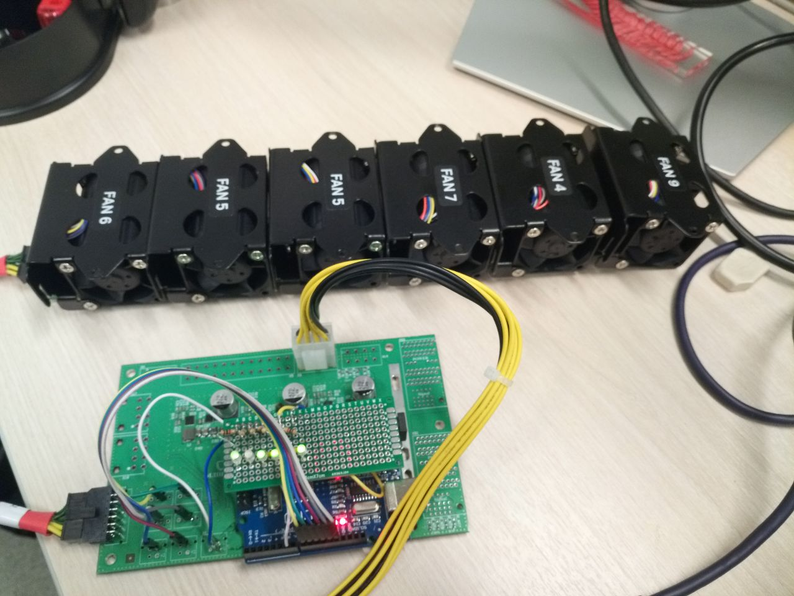

## тестирование вентиляторов c Arduino Uno

пин 6 - подача ШИМ сигнала.  
пины 8,9,10,11,12,13 - считывание сигнала с тахометров соответствующих вентиляторов.  
A0,A1,A2,A3,A4, A5 - настроены как выходы с Pull-up для включения светодиодов.  

1. После подачи питания светодиоды мигают, говоря о том что начался тест.
2. Снимаются показания стоящих вентиляторов.
3. Снимаются показания вентиляторов на 50% ШИМ.
4. Сравниваются показатели.
5. По окончанию теста светодиоды мигают и зажигаются светодиоды, которые соответствуют исправным вентиляторам.
> *Если вентилятор не исправен, то соответсвующий светодиод не будет гореть.  